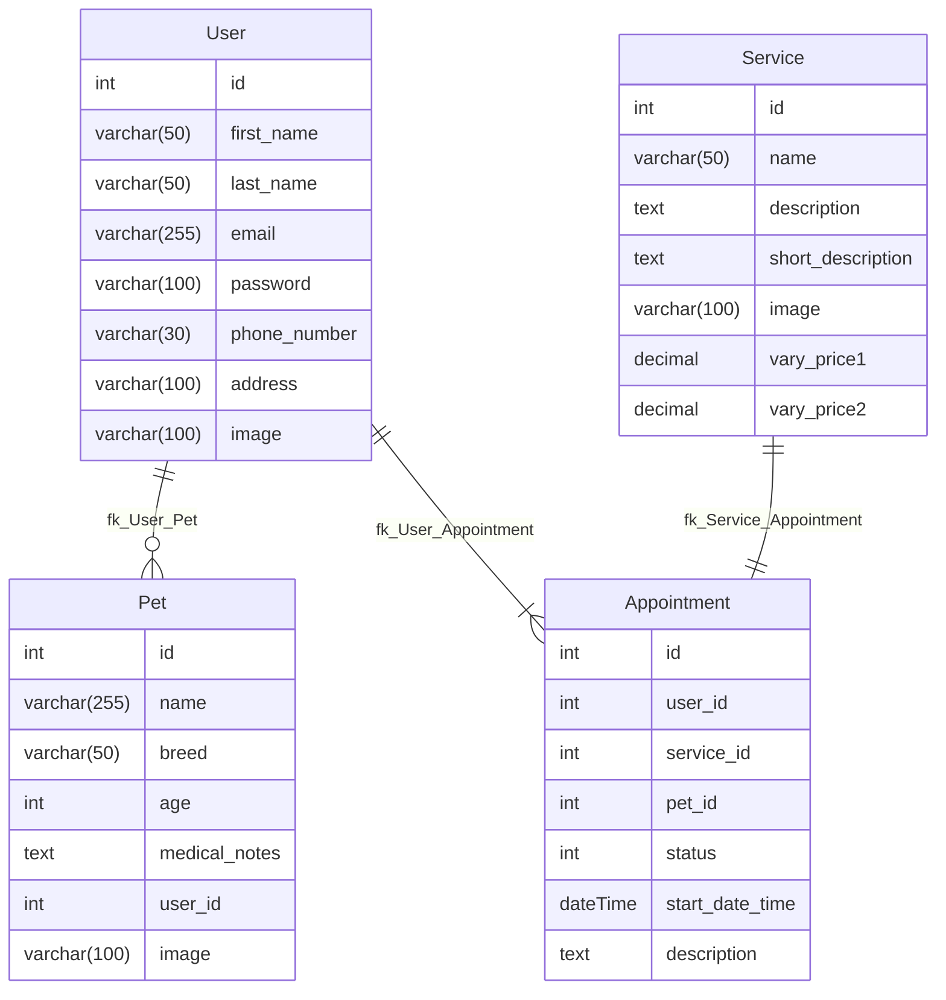

# [WOOF WASH GROOMING](https://woof-wash-grooming-3c70f6da4156.herokuapp.com)

[](https://github.com/Jordan-Boulton1/woof-wash-grooming/commits/main)
[](https://github.com/Jordan-Boulton1/woof-wash-grooming/commits/main)
[](https://github.com/Jordan-Boulton1/woof-wash-grooming)

---

Looking for a grooming service that treats your dog like family? Welcome to Woof & Wash Grooming, where every 
grooming session is more than a cut and dry—it's an experience that pampers your furry friend from head to tail!

**What We Hope to Accomplish**

Our goal at Woof & Wash Grooming is to create a sanctuary for your dogs, providing top-notch grooming services 
designed to keep them healthy, happy and looking their best. We believe that a well-groomed dog is not only a 
delight to be around, but also a healthier and more comfortable companion. We aim to make grooming a positive 
experience for every dog, ensuring they leave our care with wagging tails and a confident strut.

**Who We Target** 

We cater to all dog owners who want only the best for their dogs. Whether you have a small, medium, large, or 
extra-large dog, we have the skills and expertise to provide tailored grooming services that meet their unique needs.
If you're a busy dog parent seeking a reliable partner to keep your dog clean and well-groomed, we are here for you.

**How We Are Useful to You**

At Woof & Wash Grooming, we offer a comprehensive range of services to keep your dog looking and feeling great. From 
full grooming packages and puppy packages, to haircuts, nail trimming, ear cleaning and more, we've got it all 
covered. Our experienced groomers understand how to work with different breeds and temperaments, ensuring a 
stress-free experience for your dog.

Plus, we use premium, dog-safe products to ensure that your dog receives the best care possible. Whether you need a 
quick trim or full grooming session, we're equipped to handle it all. You can relax knowing that your dog is in good 
hands, and your dog will leave our salon clean, refreshed, and ready for cuddles.

Don't wait to give your dog the care they deserve. Visit Woof & Wash Grooming and experience the difference that 
expert grooming can make! We promise you and your furry friend will be glad you did.


## UX

When designing this webpage I wanted to achieve a balance of professionalism with a sense of calm and cleanliness.

### Colour Scheme

By choosing the colours below, I hoped to achieve the calm and cleanliness feeling.

- `#FFFFFF` used all throughout the site primarily on text elements.
- `#000000` also used all throughout the site mainly on text and border elements.
- `#87CEEB` used all throughout the site, its main use being a background-color.
- `#0B3D91` used all throughout the site, its uses being: buttons and main elements such as cards.
- `#F8F9FA` used all throughout the site, it is the main background colour for the site.

I used [coolors.co](https://coolors.co/87ceeb-0b3d91-000000-f8f9fa-ffffff) to generate my colour palette.


### Typography

- [Lora](https://fonts.google.com/specimen/Lora) was used as the primary text for the page.

- [Montserrat](https://fonts.google.com/specimen/Montserrat) was used for all nav-links and buttons.

- [Font Awesome](https://fontawesome.com) icons were used throughout the site, such as the social media icons in the footer.

## User Stories

### New Site Users

- As a new site user, I would like to **register for an account**, so that I can **access the services features**.
- As a new site user, I would like to **view the list of available grooming services**, so that I can **choose the service my dog needs**.

### Registered Site Users

- As a registered site user, I would like to **log in to my account**, so that I can **access my bookings and personalized information**.
- As a registered site user, I would like to **create an appointment**, so that I can ** schedule a grooming appointment for my dog**.
- As a registered site user, I would like to **edit my appointment**, so that I can **change the date, time or services**.
- As a registered site user, I would like to **cancel my appointment**, so that I can **free up my appointment if my plans change and allow other users to book that time slot**.
- As a registered site user, I would like to **view my past appointments**, so that I can **keep track of my  dogs grooming history**.
- As a registered site user, I would like to **edit my profile**, so that I can **update my personal information or change my password**.
- As a registered site user, I would like to **delete my profile**, so that I can **remove my account and personal data from the system**.
- As a registered site user, I would like to **log out of the website**, so that I can **ensure my session is securely closed and prevent unauthorized access to my account**.
- As a registered site user, I would like to **view my appointments via my profile**, so that I can **keep track of my upcoming appointments**.
- As a registered site user, I would like to **have access to my profile**, so that I can **keep my personal data up to date**.

### Site Admin

- As a site administrator, I should be able to **view all appointments**, so that I can **manage and monitor the appointment schedule**.
- As a site administrator, I should be able to **view all pets**, so that I can **keep track of pet information and medical notes**.
- As a site administrator, I should be able to **view all services**, so that I can **manage the services that the salon offers**.
- As a site administrator, I should be able to **view all users**, so that I can **manage user accounts and information (with user permission)**.

## Wireframes

To follow best practice, wireframes were developed for mobile, tablet, and desktop sizes.
I've used [Figma](https://www.figma.com/) to design my site wireframes.

### Mobile Wireframes

<details>
<summary> Click here to see the Mobile Wireframes </summary>

Home
  - 

About
  - 

Services
  - 

Appointment
  - 

</details>

### Tablet Wireframes

<details>
<summary> Click here to see the Tablet Wireframes </summary>

Home
  - 

About
  - 

Services
  - 

Appointment
  - 

</details>

### Desktop Wireframes

<details>
<summary> Click here to see the Desktop Wireframes </summary>

Home
  - 

About
  - 

Services
  - 

Appointment
  - 

Navbars
  - 

</details>

## Features

There are many features on the website which are easy to follow and navigate, creating a nice user experience.

### Existing Features

#### Navbar, Footer & Sidebar

- **Navbar**: Featured on every single page is the navigation bar, this enhances user experience by providing users with clear access to all pages of the website, increasing the visibility of the highlighted key pages.


- **Sidebar**: Mobile users, will have access to the *sidebar*, this provides the same benefits as the navigation bar allowing users to easily access all pages of the site on mobile devices.


- **Footer**: Also featured on every single page is the footer, equipped with social media links and copyright information, this enhances user engagement, fosters brand consistency, ensures legal compliance, and improves navigational accessibility.


#### Home Page

 - **Hero Image**: The website features a captivating hero image of a well-groomed, happy dog, effectively showcasing the quality and professionalism of our services, creating an immediate visual appeal and trust for users.


- **Welcome Message**: The welcome message emphasizes the award-winning services and commitment to quality pet care, establishing a professional and trustworthy impression.


- **Service Overview**: The service overview on the home page provides brief descriptions of key services offered, including puppy grooming, a full grooming package, ear cleaning, and nail trimming, emphasizing their comprehensive care for pets.


- **Find Out More**: This button, also featured in the service overview section, directs users to detailed descriptions of the grooming services, enhancing their understanding and helping them make informed decisions about the care options available for their pets.


- **About Us**: The about us section highlights the sites dedication to high-quality grooming, professional team, and continuous learning, fostering trust and connection with site users.
- **Learn More About Us**: This button directs users to additional details about our grooming salon's mission and team.


- **Testimonials**: The testimonials section showcases positive customer reviews, providing social proof that 
  enhances the site's credibility and trustworthiness. For users, this section offers real life experiences and endorsements, aiding in their decision-making and building confidence in the quality of the grooming services provided.


- **Contact Us**:  The contact us section provides easy access to direct contact information, enhancing the site's accessibility and encouraging user interaction. For users, it offers multiple ways to reach out for inquiries, support, or appointment scheduling, ensuring a seamless communication experience.


#### About Page

- **About Our Salon**: The section emphasizes the commitment to providing a welcoming and professional environment, detailing the state-of-the-art facilities and personalized care approach. This enhances the site's credibility and assures users of a high-quality grooming experience for their pets.


- **Meet Our Team**: The section highlights the expertise and passion of the staff members, detailing their qualifications and dedication to pet care. This adds credibility to the site by showcasing professional qualifications and fosters trust in users by introducing them to the skilled individuals who will care for their pets.


- **Community Involvement**: The section highlights active participation in local events and partnerships with animal shelters, showcasing commitment to giving back. This enhances the site's reputation as a socially responsible business and benefits users by aligning with their values of community support and animal welfare.


#### Services Page

- **Our Grooming Services**: The section provides a full list of the variety of grooming options available, including relevant images that correspond to each grooming options and approximate prices for each service. This enhances the site's value by clearly communicating the range and quality of services offered, and benefits users by helping them to easily identify and select the best grooming care available for their pet.


- **About Our Prices**: The section explains the pricing structure for various grooming services, emphasizing transparency and value. This adds credibility to the site by being upfront about costs and benefits users by allowing them to understand and budget for the grooming services their pets need.


- **Gallery**: The section features images of pets during grooming, showcasing the quality and impact of the 
  services provided. This enhances the site's value by visually demonstrating their expertise and benefits users by providing a clear, visual representation of the grooming experience they can expect for their pets.


#### Appointment Page

- **Book An Appointment**: The section offers an online booking form with a built in date picker for scheduling grooming sessions, streamlining the appointment process. This adds value to the site by enhancing user convenience and operational efficiency, and benefits users by providing a simple, quick way to secure grooming services for their pets.


#### Profile Page

- **Profile**: The profile page allows users to view and update their personal information, manage their pet profiles, and track grooming appointments. This feature adds value to the site by enhancing user engagement and personalization, and benefits users by providing a convenient way to manage all their grooming-related information in one place.


- **Edit Pet Modal**: This allows users to update their pet's personal information, such as name, breed, and grooming preferences. This adds value to the site because it ensures up to date, accurate pet information for tailored grooming services, and benefits the user by providing an easy way to keep their pet's details current and specific to their grooming needs.


- **Edit Appointment Modal**: This allows users to modify any upcoming grooming appointments, including date, time, and the service selected. This adds value to the site because it increases flexibility and user control over scheduling, and benefits the user by providing a convenient way to adjust appointments to fit their schedule, enhancing overall user experience.


- **Profile Edit**: The user will be redirected to the profile edit page, where they can change their profile picture 
  and update account details. This enhances the site's data accuracy and functionality while providing users with a convenient, centralized page for updating personal information.


#### Register Page

- **Register An Account**: The register form allows user to create a new account by entering their personal details. This expands the site's user base and provides users with an easy streamlined process to set up a personalized account for tailored grooming services.


#### Login

- **Login**: The login page allows users to securely access their accounts by entering their email and password. This feature enhances site security and user retention, providing users with a quick and convenient way to manage their profiles and appointments.


#### 404 Error Page

- The 404 page informs users that the requested page is not found and provides navigation options to return to the home 
  page or other sections. This enhances site usability by preventing dead ends and guiding users back to functional areas, ensuring a smooth browsing experience.


### Future Features

- **Forgot Password**: I would have liked to add this feature where the user can click on the forgot password link on the login page. The user would be redirected to a page to ask for email confirmation, upon successful confirmation a reset link would be sent to their email address.

- **Payment System**: Another feature I would have liked to add to this project, in order to streamline the user experience the user would be redirected to a secure payment interface where they could enter their details and pay for their grooming services online.

## Tools & Technologies Used

- [](https://tim.2bn.dev/markdown-builder) used to generate README and TESTING templates.
- [](https://git-scm.com) used for version control. (`git add`, `git commit`, `git push`)
- [](https://github.com) used for secure online code storage.
- [](https://code.visualstudio.com) used as my local IDE for development.
- [](https://en.wikipedia.org/wiki/HTML) used for the main site content.
- [](https://en.wikipedia.org/wiki/CSS) used for the main site design and layout.
- [](https://www.javascript.com) used for user interaction on the site.
- [](https://www.python.org) used as the back-end programming language.
- [](https://www.heroku.com) used for hosting the deployed   site.
- [](https://getbootstrap.com) used as the front-end CSS framework for modern responsiveness and pre-built components.
- [](https://www.djangoproject.com) used as the Python framework for the site.
- [](https://www.postgresql.org) used as the relational database management.
- [](https://dbs.ci-dbs.net) used as the Postgres database from Code Institute.
- [](https://cloudinary.com) used for online static file storage.
- [](https://whitenoise.readthedocs.io) used for serving static files with Heroku.
- [](https://www.figma.com/) used for creating wireframes.
- [](https://fontawesome.com) used for the icons.
- [](https://chat.openai.com) used to help debug, troubleshoot, and explain things.
- [](https://www.mermaidchart.com/) used for creating ERD diagrams.
- [](https://djecrety.ir/) tool used for generating django secret keys.
- [](https://logo.com/) tool used to create the logo for the website.

## Database Design

Entity Relationship Diagrams (ERD) help to visualize database architecture before creating models.
Understanding the relationships between different tables can save time later in the project.



I have used [mermaidchart](https://www.mermaidchart.com/)  to generate an ERD.

## Agile Development Process

### GitHub Projects

[GitHub Projects](https://github.com/Jordan-Boulton1/woof-wash-grooming/projects) served as an Agile tool for this project.
It isn't a specialized tool, but with the right tags and project creation/issue assignments, it can be made to work.

Through it, user stories, issues, and milestone tasks were planned, then tracked on a weekly basis using the basic Kanban board.


### GitHub Issues

[GitHub Issues](https://github.com/Jordan-Boulton1/woof-wash-grooming/issues) served as another Agile tool.
There, I used my own **User Story Template** to manage user stories.

It also helped with milestone iterations on a weekly basis.

- [Open Issues](https://github.com/Jordan-Boulton1/woof-wash-grooming/issues) [](https://github.com/Jordan-Boulton1/woof-wash-grooming/issues)

    

- [Closed Issues](https://github.com/Jordan-Boulton1/woof-wash-grooming/issues?q=is%3Aissue+is%3Aclosed) [](https://github.com/Jordan-Boulton1/woof-wash-grooming/issues?q=is%3Aissue+is%3Aclosed)

    

### MoSCoW Prioritization

I've decomposed my Epics into stories prior to prioritizing and implementing them.
Using this approach, I was able to apply the MoSCow prioritization and labels to my user stories within the Issues tab.

- **Must Have**: guaranteed to be delivered (*max 60% of stories*)
- **Should Have**: adds significant value, but not vital (*the rest ~20% of stories*)
- **Could Have**: has small impact if left out (*20% of stories*)
- **Won't Have**: not a priority for this iteration

## Testing

> [!NOTE]  
> For all testing, please refer to the [TESTING.md](TESTING.md) file.

## Deployment

The live deployed application can be found deployed on [Heroku](https://woof-wash-grooming-b7fa1160192f.herokuapp.com/).

### PostgreSQL Database

This project uses a [Code Institute PostgreSQL Database](https://dbs.ci-dbs.net).

To obtain my own Postgres Database from Code Institute, I followed these steps:

- Signed in to the CI LMS using my email address.
- An email was sent to me with my new Postgres Database.

> [!CAUTION]  
> - PostgreSQL database's by Code Institute are only available to CI Students.
> - You must acquire your own PostgreSQL database through some other method
> if you plan to clone/fork this repository.
> - Code Institute students are allowed a maximum of 8 databases.
> - Databases are subject to deletion after 18 months.

### Cloudinary API

This project uses the [Cloudinary API](https://cloudinary.com) to store media assets online, due to the fact that Heroku doesn't persist this type of data.

To obtain your own Cloudinary API key, create an account and log in.

- For *Primary interest*, you can choose *Programmable Media for image and video API*.
- Optional: *edit your assigned cloud name to something more memorable*.
- On your Cloudinary Dashboard, you can copy your **API Environment Variable**.
- Be sure to remove the `CLOUDINARY_URL=` as part of the API **value**; this is the **key**.

### Heroku Deployment

This project uses [Heroku](https://www.heroku.com), a platform as a service (PaaS) that enables developers to build, run, and operate applications entirely in the cloud.

Deployment steps are as follows, after account setup:

- Select **New** in the top-right corner of your Heroku Dashboard, and select **Create new app** from the dropdown menu.
- Your app name must be unique, and then choose a region closest to you (EU or USA), and finally, select **Create App**.
- From the new app **Settings**, click **Reveal Config Vars**, and set your environment variables.

> [!IMPORTANT]  
> This is a sample only; you would replace the values with your own if cloning/forking my repository.

| Key | Value |
| --- | --- |
| `CLOUDINARY_URL` | user's own value |
| `DATABASE_URL` | user's own value |
| `DISABLE_COLLECTSTATIC` | 1 (*this is temporary, and can be removed for the final deployment*) |
| `SECRET_KEY` | user's own value |

Heroku needs three additional files in order to deploy properly.

- requirements.txt
- Procfile
- runtime.txt

You can install this project's **requirements** (where applicable) using:

- `pip3 install -r requirements.txt`

If you have your own packages that have been installed, then the requirements file needs updated using:

- `pip3 freeze --local > requirements.txt`

The **Procfile** can be created with the following command:

- `echo web: gunicorn app_name.wsgi > Procfile`
- *replace **app_name** with the name of your primary Django app name; the folder where settings.py is located*

The **runtime.txt** file needs to know which Python version you're using:
1. type: `python3 --version` in the terminal.
2. in the **runtime.txt** file, add your Python version:
	- `python-3.9.18`

For Heroku deployment, follow these steps to connect your own GitHub repository to the newly created app:

Either:

- Select **Automatic Deployment** from the Heroku app.

Or:

- In the Terminal/CLI, connect to Heroku using this command: `heroku login -i`
- Set the remote for Heroku: `heroku git:remote -a app_name` (replace *app_name* with your app name)
- After performing the standard Git `add`, `commit`, and `push` to GitHub, you can now type:
	- `git push heroku main`

The project should now be connected and deployed to Heroku!

### Local Deployment

This project can be cloned or forked in order to make a local copy on your own system.

For either method, you will need to install any applicable packages found within the *requirements.txt* file.

- `pip3 install -r requirements.txt`.

You will need to create a new file called `env.py` at the root-level,
and include the same environment variables listed above from the Heroku deployment steps.

> [!IMPORTANT]  
> This is a sample only; you would replace the values with your own if cloning/forking my repository.

Sample `env.py` file:

```python
import os

os.environ.setdefault("CLOUDINARY_URL", "user's own value")
os.environ.setdefault("DATABASE_URL", "user's own value")
os.environ.setdefault("SECRET_KEY", "user's own value")

# local environment only (do not include these in production/deployment!)
os.environ.setdefault("DEBUG", "True")
```

Once the project is cloned or forked, in order to run it locally, you'll need to follow these steps:

- Start the Django app: `python3 manage.py runserver`
- Stop the app once it's loaded: `CTRL+C` or `⌘+C` (Mac)
- Make any necessary migrations: `python3 manage.py makemigrations`
- Migrate the data to the database: `python3 manage.py migrate`
- Create a superuser: `python3 manage.py createsuperuser`
- Load fixtures (if applicable): `python3 manage.py loaddata file-name.json` (repeat for each file)
- Everything should be ready now, so run the Django app again: `python3 manage.py runserver`

#### Cloning

You can clone the repository by following these steps:

1. Go to the [GitHub repository](https://github.com/Jordan-Boulton1/woof-wash-grooming) 
2. Locate the Code button above the list of files and click it 
3. Select if you prefer to clone using HTTPS, SSH, or GitHub CLI and click the copy button to copy the URL to your clipboard
4. Open Git Bash or Terminal
5. Change the current working directory to the one where you want the cloned directory
6. In your IDE Terminal, type the following command to clone my repository:
	- `git clone https://github.com/Jordan-Boulton1/woof-wash-grooming.git`
7. Press Enter to create your local clone.

Alternatively, if using Gitpod, you can click below to create your own workspace using this repository.

[](https://gitpod.io/#https://github.com/Jordan-Boulton1/woof-wash-grooming)

Please note that in order to directly open the project in Gitpod, you need to have the browser extension installed.
A tutorial on how to do that can be found [here](https://www.gitpod.io/docs/configure/user-settings/browser-extension).

#### Forking

By forking the GitHub Repository, we make a copy of the original repository on our GitHub account to view and/or make changes without affecting the original owner's repository.
You can fork this repository by using the following steps:

1. Log in to GitHub and locate the [GitHub Repository](https://github.com/Jordan-Boulton1/woof-wash-grooming)
2. At the top of the Repository (not top of page) just above the "Settings" Button on the menu, locate the "Fork" Button.
3. Once clicked, you should now have a copy of the original repository in your own GitHub account!

## Credits

### Content

| Source | Location | Notes |
| --- | --- | --- |
| [Markdown Builder](https://tim.2bn.dev/markdown-builder) | README and TESTING | tool to help generate the Markdown files |
| [Bootstrap](https://getbootstrap.com/docs/5.3/components/navbar/) | entire site | responsive HTML/CSS/JS navbar |
| [Bootstrap](https://getbootstrap.com/docs/5.3/components/modal/) | profile page | interactive pop-up (modal) |
| [Bootstrap](https://getbootstrap.com/docs/5.3/components/carousel/) | services page | interactive carousel |
| [Bootstrap](https://getbootstrap.com/docs/5.3/components/card/) | profile page | interactive pet and appointment cards |
| [Testdriven](https://testdriven.io/blog/django-custom-user-model/) | `models.py` | creating a custom user |
| [Django Docs](https://docs.djangoproject.com/en/5.0/topics/auth/default/) | `models.py` `views.py` | user creation form |
| [Django Docs](https://docs.djangoproject.com/en/5.0/ref/forms/widgets/) | `forms.py` | django widgets documentation |
| [Bootstrapbrain](https://bootstrapbrain.com/component/bootstrap-registration-form-example/) | appointment page | bootstrap registration form example |
| [W3Schools](https://www.w3schools.com/cssref/sel_element_pluss.php) | style.css | CSS element+element selector |
| [Shields](https://shields.io/docs/logos) | readme | shield icon documentation |
| [strftime](https://strftime.org) | CRUD functionality | helpful tool to format date/time from string |
| [WhiteNoise](http://whitenoise.evans.io) | entire site | hosting static files on Heroku temporarily |
| [GitHub Docs](https://docs.github.com/en/get-started/writing-on-github/working-with-advanced-formatting/creating-diagrams) | readme | implementing the ERD diagram |
| [StackOverflow](https://stackoverflow.com/questions/45656405/browser-prevent-post-data-resubmit-on-refresh-using-only-javascript) | modals | prevent resubmitting data on modal forms |

### Media

| Source | Location | Type | Notes |
| --- | --- | --- | --- |
| [Unsplash](https://unsplash.com/photos/dog-running-on-beach-during-daytime-yihlaRCCvd4) | home page | image | hero image background |
| [Font Awesome](https://fontawesome.com/icons/envelope?f=classic&s=solid) | home page | image | email icon |
| [Unsplash](https://unsplash.com/photos/long-coated-brown-dog-KZv7w34tluA) | appointment page | image | appointment form |
| [Font Awesome](https://fontawesome.com/icons/calendar?f=classic&s=solid) | appointment page | image | calendar icon |
| [Pexels](https://www.pexels.com/photo/groomer-standing-and-washing-dog-19145897/) | about page | image | About our salon |
| [Pexels](https://www.pexels.com/photo/groomer-trimming-dog-19145886/) | about page | image | head groomer |
| [Pexels](https://www.pexels.com/photo/female-veterinarian-grooming-a-dog-6816849/) | about page | image | assistant groomer |
| [Pexels](https://www.pexels.com/photo/dog-groomer-at-work-19145893/) | about page | image | apprentice groomer |
| [Freepik](https://www.freepik.com/free-photo/man-training-his-pitbull-dogs_19333887.htm) | about page | image | community involvement |
| [Flaticon](https://www.flaticon.com/free-icon/dog_3636096?term=dog+bath&page=1&position=3&origin=search&related_id=3636096) | services & profile page | image |  bath & brush service icon |
| [Flaticon](https://www.flaticon.com/free-icon/trimming_3993873?term=nail+trim&page=1&position=1&origin=search&related_id=3993873) | services, profile & home page | image |  nail clipping service icon |
| [Flaticon](https://www.flaticon.com/free-icon/ear-cleaning_9769458?term=ear+cleaning&page=1&position=29&origin=search&related_id=9769458) | services, profile & home page| image |  ear cleaning service icon |
| [Flaticon](https://www.flaticon.com/free-icon/pet_1292684?term=dog+grooming&page=1&position=23&origin=search&related_id=1292684) | services, profile & home page | image | full grooming package service icon |
| [Flaticon](https://www.flaticon.com/free-icon/puppy_1959927?term=puppy&page=1&position=3&origin=search&related_id=1959927) | services, profile & home page | image | puppy grooming package service icon |
| [Flaticon](https://www.flaticon.com/free-icon/clean_2779423?term=teeth+clean&page=1&position=1&origin=search&related_id=2779423) | services & profile page | image | teeth cleaning service icon |
| [Flaticon](https://www.flaticon.com/free-icon/deshedding_3636484?term=deshedding&page=1&position=1&origin=search&related_id=3636484) | services & profile page | image | deshedding service icon |
| [Flaticon](https://www.flaticon.com/free-icon/treatment_6680035?term=flea+treatment&page=1&position=3&origin=search&related_id=6680035) | services & profile page | image | flea & tick treatment service icon |
| [Posh Dugz](https://www.facebook.com/p/Posh-Dugz-Dog-Grooming-100062609805112/) | services page | image | provided me with the images of my dog while he was being groomed |
| [Unsplash](https://unsplash.com/photos/dog-biting-brown-wood-on-road-uNNCs5kL70Q) | 404 page | image | 404 error image |
| [Font Awesome](https://fontawesome.com/icons/tiktok?f=brands&s=solid) | footer | image | TikTok icon |
| [Font Awesome](https://fontawesome.com/icons/instagram?f=brands&s=solid) | footer | image | Instagram icon |
| [Font Awesome](https://fontawesome.com/icons/x-twitter?f=brands&s=solid) | footer | image | Twitter icon |
| [Font Awesome](https://fontawesome.com/icons/facebook?f=brands&s=solid) | footer | image | Facebook icon |
| [Font Awesome](https://fontawesome.com/icons/phone?f=classic&s=solid) | home & profile page | image | Phone icon |
| [Font Awesome](https://fontawesome.com/icons/location-dot?f=classic&s=solid) | profile page | image | Location icon |
| [Pixabay](https://pixabay.com/illustrations/cat-paws-paws-isolated-2674056/) | profile page | image | card background |
| [Pixabay](https://pixabay.com/vectors/animal-canine-dog-head-pet-2023227/) | profile page | image | default pet image |
| [GitHub](https://github.com/Code-Institute-Solutions/blog/blob/main/10_create_about_app/static/images/nobody.jpg) | entire site | image | default user image |

### Acknowledgements

- I would like to thank my Code Institute mentor, [Tim Nelson](https://github.com/TravelTimN) for their support throughout the development of this project.
- I would like to thank the [Code Institute](https://codeinstitute.net) tutor team for their assistance with troubleshooting and debugging some project issues.
- I would like to thank the [Code Institute Slack community](https://code-institute-room.slack.com) for the moral support; it kept me going during periods of self doubt and imposter syndrome.
- I would like to thank my partner (Stefani), for believing in me, and allowing me to make this transition into software development.
- I would like to thank the kind folks at [Posh Dugz Dog Grooming](https://www.facebook.com/p/Posh-Dugz-Dog-Grooming-100062609805112/) for providing me with the images of my dog (Storm) to use for my project.
